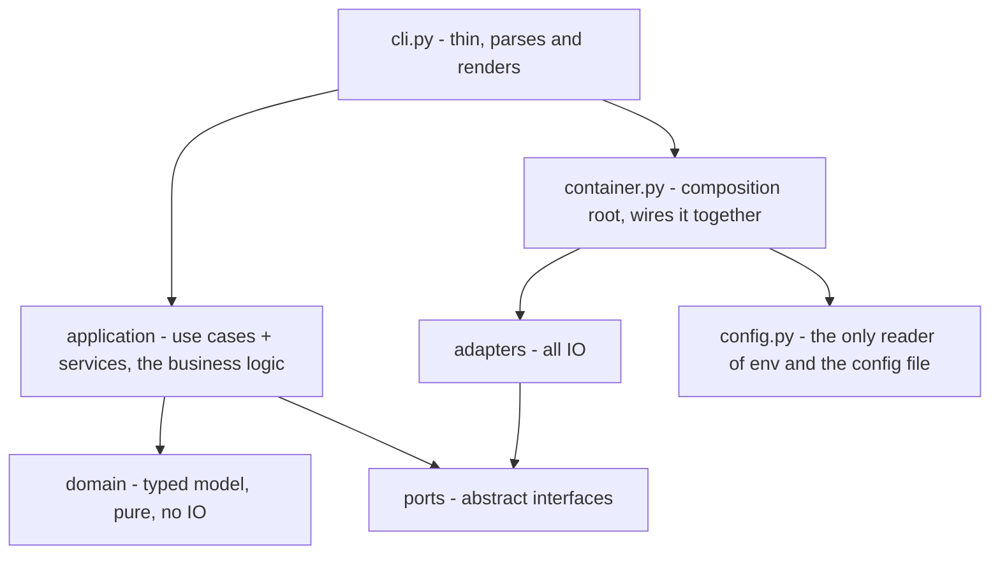
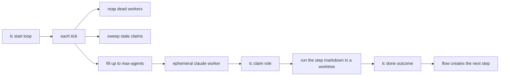

# Architecture

lightcycle is a workflow-agnostic engine: a CLI (`lc`) over a pipeline of ephemeral agents. It is built hexagonal (ports and adapters) - dependencies point inward, and the domain depends on nothing.

## Layers

- **domain/** - entities (`Node`) and value objects (`State`), plus pure logic: state roll-up, lane derivation, artifact contracts, flow assembly, retro signals. Stdlib only, no IO, no ambient time/uuid/random. Millisecond unit tests.
- **ports/** - the interfaces the application depends on: `StorePort`, `GitPort`, `FsPort`, `WorkersPort`, `SpawnerPort`, `RunLockPort`.
- **application/** - one use case per action, grouped by activity (inspect, work, flow, pool, feedback, setup), plus services (`FlowService`, `WorktreeService`). Depends on ports, not adapters.
- **adapters/** - all IO: `SqliteStore`, git, the worker spawner, the workers registry, the filesystem, the run-lock. The only callers of `sqlite3` / `git` / `subprocess`.
- **config.py / container.py** - the environment boundary and the composition root.

The engine ships **zero runtime dependencies** (stdlib only). Dev/test tooling (`uv`, `pytest`) is separate and never imported by `lightcycle/`.

## The pool

`lc start` is a single long-lived loop. Each tick it reaps dead workers, sweeps stale claims, checks open PRs, then fills up to `max-agents` workers from the ready queue. A worker is an **ephemeral claude process** that claims exactly one step, runs it, and exits.

## Agnostic by construction

The engine and `lc` know nothing about a specific workflow. The steps (`write-code`, `review-code`, `open-pr`, ...), their roles, and their artifact contracts live in a **workflow source** - `workflows/*.md` + `steps/*.md` in a pullable git origin - composed from generic primitives (`lc new`, `lc attach`, `lc done`, `lc dep`). Point lightcycle at a different workflow - a frontend repo, a data pipeline - by authoring or pulling a different source, not by editing the code. See [installation-and-config.md](installation-and-config.md) for workflow sources.
