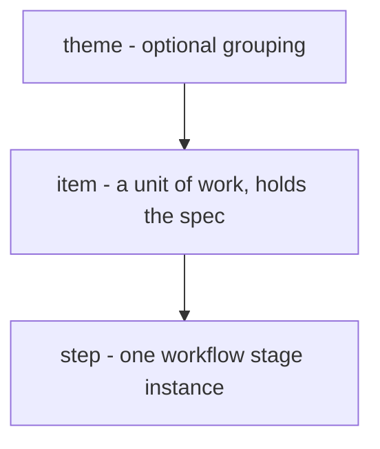
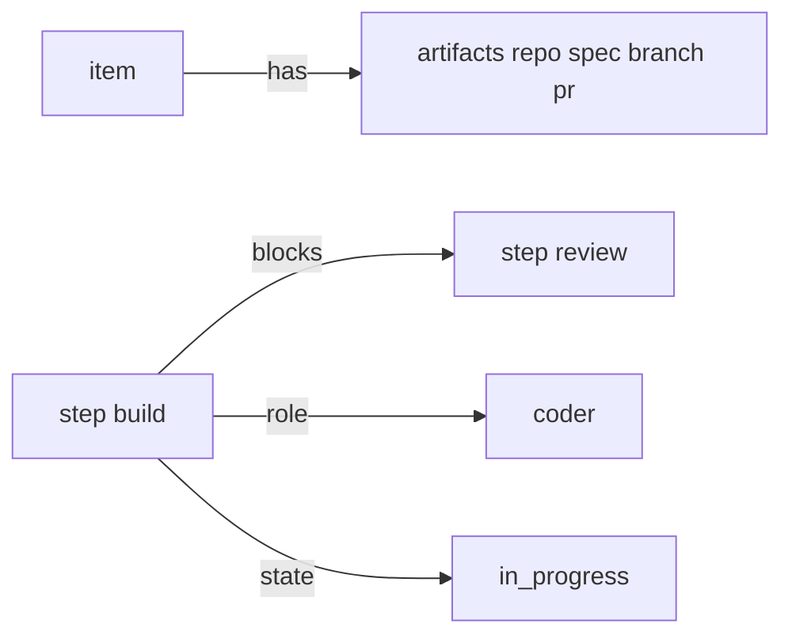

# Data model

lightcycle tracks all work as **nodes** in one SQLite table (`nodes`). A node is one of three types,
forming an optional three-level hierarchy.



- **theme** - a durable, optional grouping of related items (e.g. Worker resilience). Themes are a
  backlog concern; work does not have to sit under one.
- **item** - the unit of work. It carries the artifacts (spec, repo, branch, PR) and moves through
  the workflow via its steps.
- **step** - one instance of a workflow stage (build, review, open-pr, ...). Steps are what agents
  actually claim and execute.

## Identity

An id nests under its parent: a child's id is its parent's id plus `.N`.

```
tg-18            item (filed with no theme)
  tg-18.1        step (build)
  tg-18.5        step (ready-merge)

LC-3             theme
  LC-3.1         item
    LC-3.1.1     step (build)
```

The prefix is the project **shortcode** (`shortcode: LC` in the config). Because a theme is optional,
a top-level `LC-N` may be a theme or a standalone item - the type comes from the node, not the id
shape. (Aligning spec/branch/PR identity to the item id is tracked as a backlog item.)

## The one lifecycle field: `state`

Every node has a single `state` (see [state-lifecycle.md](state-lifecycle.md)):

```
backlogged  ->  ready  ->  in_progress  ->  done
```

A **step** stores its own state. An **item** or **theme** does not store a state - it is **derived**
as a roll-up of its children on every read, so a parent can never disagree with its children.

Two things are kept **orthogonal** to the state (baking them in would multiply the states):

- **role** - who processes the node: `coder`, `reviewer`, `open-pr`, `watch-pr`, `human`, ... A ready
  step with `role=human` is a human gate (it shows in the inbox); the state is still just `ready`.
- **outcome** - how a `done` node ended: `done`, `merged`, `abandoned`, `rejected`, ... `done` is the
  single terminal state; the outcome records the flavour.

## Attachments

- **artifacts** - typed values attached to an **item**: `repo`, `spec`, `branch`, `pr`, `feedback`,
  `retro`. Steps declare `accepts` / `produces` in their frontmatter, and the engine checks the
  item's artifacts against that contract before a step may close (e.g. `build` produces `branch`).
- **deps** - a node can be blocked by another. A step with an unmet dependency stays `backlogged`
  and becomes claimable (`ready`) only once every blocker is closed.


