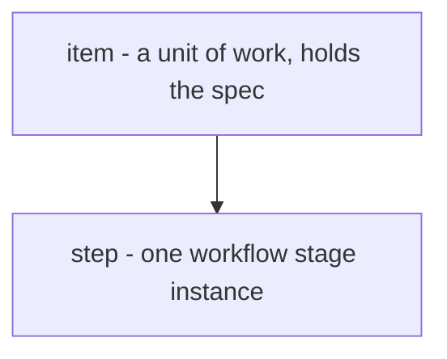
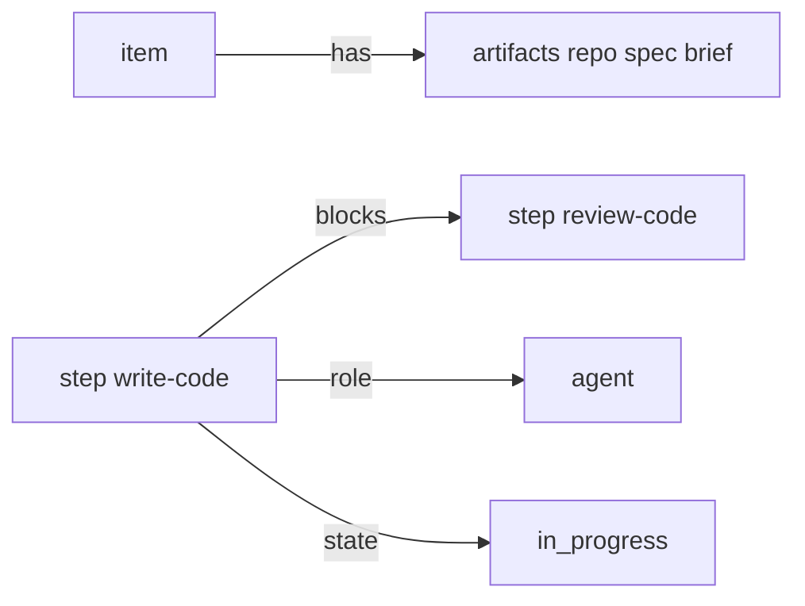

# Data model

lightcycle tracks work as **items** and **steps**, in two SQLite tables (`items`, `steps`) with no shared shape. Together they form a fixed two-level hierarchy; `passes` and `phase_runs` hang off an item as records, not as further levels.


```mermaid
graph TD
  item[item - a unit of work, holds the spec] --> step[step - one workflow stage instance]
```

- **item** - the unit of work, and the top of the tree. It carries the `description` (the brief), the workflow-defined artifacts, the `repo` and the workflow pin, and moves through the workflow via its steps. An item has no parent, no role and no notes.
- **step** - one instance of a workflow stage (write-code, review-code, open-pr, ...). Steps are what agents actually claim and execute. A step's `item` is required and fixed at creation; it has no description, no artifacts and no workflow of its own. The branch, the PR and the comment ledger belong to the **phase run**, not to the step.
- **pass** - one traversal of the workflow for an item. A flow that loops runs several; a stage's `pass-end:` grammar declares where a traversal ends, which is why the boundary is stated and not derived (a rework back-edge and a delivery back-edge are the same shape in the graph).
- **phase run** - one phase within one pass. A phase is one PR gate, so a run owns exactly one branch and one PR, plus the comment ledger for that PR: `comments_dispatched_through` (written by the engine at spawn) and `comments_handled_through` (written by the agent at completion). Pass and phase are orthogonal - a second pass through the same phase is a different run, which is why a run can never resolve to an earlier pass's already-merged PR.

## Identity

An id nests under its parent: a child's id is its parent's id plus `.N`.

```
tg-18            item
  tg-18.1        step (write-code)
  tg-18.5        step (await-merge)
```

The prefix is the owning project's **shortcode** (see "Project registry" in [ontology.md](ontology.md)) - explicit at registration or defaulted from the project's identity, uppercased. Every registered project has its own; it is not a single engine-wide config value. A top-level `<shortcode>-N` is always an item. (Aligning spec/branch/PR identity to the item id is tracked as a backlog item.)

A **planned step**'s id (see "The model (nouns)" in [ontology.md](ontology.md)) follows the same `parent.N` nesting as a real step's id, but is advisory, not guaranteed: it is computed positionally from the item's currently-filed step count, and the store's id counter does not roll back when a step is deleted. It matches the id the engine later mints for that position only when no step under the item has ever been deleted.

## The one lifecycle field: `state`

An item and a step each have a single `state` (see [state-lifecycle.md](state-lifecycle.md)):

```
backlogged  ->  ready  ->  in_progress  ->  done
```

A **step** stores its own state. An **item** does not store a state - it is **derived** as a roll-up of its steps on every read, so an item can never disagree with its steps.

Two things are kept **orthogonal** to the state (baking them in would multiply the states):

- **role** - who processes the node: `agent` or `human`. A ready step with `role=human` is a human gate (it shows in the inbox); the state is still just `ready`. The stage a step performs is its `stage` field.
- **outcome** - how a `done` node ended: `done`, `merged`, `abandoned`, `rejected`, ... `done` is the single terminal state; the outcome records the flavour.

## Attachments

- **artifacts** - typed values attached to an **item**: `repo`, `spec`, `brief`, `blueprint`, `spec-amendment`. Steps declare `accepts` / `produces` in their frontmatter, and the engine checks the item's artifacts against that contract before a step may close. `branch`, `pr` and `comments-handled` are NOT artifacts: `lc attach` routes them onto the item's current phase run, which is where every reader looks for them.
- **deps** - a node can be blocked by another. A step with an unmet dependency stays `backlogged` and becomes claimable (`ready`) only once every blocker is closed.


```mermaid
graph LR
  item[item] -->|has| art[artifacts repo spec brief]
  step1[step write-code] -->|blocks| step2[step review-code]
  step1 -->|role| r[agent]
  step1 -->|state| s[in_progress]
```
