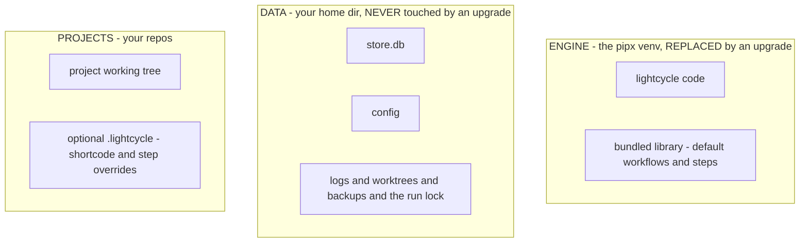

# Installation, config, and upgrades

## Install

```
pipx install git+https://github.com/kenmclennan/lightcycle
lc init                 # create the store + seed the home config (run once)
```

The engine runs on system `python3` with zero runtime dependencies, so `lc` works without any venv
activation.

## The three homes

lightcycle keeps code, data, and project settings strictly apart. This split is what makes upgrades
safe.



- **Engine** (`~/.local/pipx/venvs/lightcycle`) - the code plus the bundled `library/` of default
  workflows and step markdown. This is the only thing an upgrade changes.
- **Data** (`~/.lightcycle`, the `data_root`) - `store.db`, the `config` file, `logs/`,
  `.worktrees/` (isolated per-item checkouts), `backups/`, and the `.lc-run.pid` singleton lock.
- **Projects** - your repos under the configured projects root; each may carry a `.lightcycle/`
  override directory.

`LC_HOME` overrides the data root and `LC_ROOT_OVERRIDE` overrides both data and library - the
integration tests use these to point at a throwaway store. Never run against the live store by hand.

## Config

`~/.lightcycle/config` is the single boundary to the environment. Values are required and seeded
visibly (no hidden defaults). Show or edit with `lc config [--edit]`.

| key                                                                       | meaning                                                    |
| ------------------------------------------------------------------------- | ---------------------------------------------------------- |
| `projects`                                                                | root under which project repos live                        |
| `specs`                                                                   | root where spec files live                                 |
| `shortcode`                                                               | id prefix for new top-level nodes (e.g. `LC` gives `LC-1`) |
| `default-workflow`                                                        | the workflow name used when an item does not name one      |
| `max-agents`                                                              | worker cap the pool fills to each tick                     |
| `poll-seconds`                                                            | pool tick interval                                         |
| `branch-prefix`                                                           | prefix for worktree branches                               |
| `max-boot-seconds` / `max-session-seconds`                                | worker boot and session caps                               |
| `retro-interval-items`                                                    | closed items between retro audits                          |
| `worktree-retries` / `worktree-retry-sleep` / `worker-history` / `editor` | pool + tooling knobs                                       |

## Project-level overrides

`lc init <project>` scaffolds a project's `.lightcycle/` with its own `config` (a per-project
`shortcode`) and optional workflow/step files. For a node in that project, a step file in the
project's `.lightcycle/steps/` **takes precedence over** the bundled library step of the same name -
so a project can customise its workflow without forking the engine. Resolution order:

```
project .lightcycle/steps/<name>.md   ->   engine bundled library/steps/<name>.md
```

## Upgrades

```
lc upgrade            # check remote version, upgrade in place if newer
lc upgrade --check    # report only, do not install
```

`lc upgrade` compares the installed `__version__` against the version on the repo's `main`, and if
newer runs `UV_VENV_CLEAR=1 pipx install --force git+...` (the `UV_VENV_CLEAR=1` is required when
pipx uses the `uv` backend, which otherwise refuses to overwrite the existing venv).

What an upgrade **changes**: the engine venv (code + bundled library). What it **does not touch**:
`~/.lightcycle` (your store, config, logs, worktrees) and any project `.lightcycle/` overrides. Your
data and customisations survive every upgrade.

Schema changes are handled separately: when a new engine first opens a store written by an older
schema, it **backs the store up** (gzipped, into `~/.lightcycle/backups/`) and migrates in place.
Migrations are idempotent. Stop the pool loop before upgrading, so the old engine is not running
against a newly-migrated store; restart it after.
