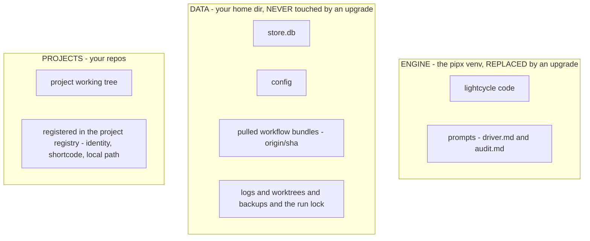

# Installation, config, and upgrades

## Install

```
pipx install git+https://github.com/kenmclennan/lightcycle
lc init                 # create the store + seed the home config (run once)
```

The engine runs on system `python3` with zero runtime dependencies, so `lc` works without any venv activation.

## The homes

lightcycle keeps code, data, and pulled workflows strictly apart. This split is what makes upgrades safe.


```mermaid
graph TD
  subgraph engine[ENGINE - the pipx venv, REPLACED by an upgrade]
    code[lightcycle code]
    prompts[prompts - driver.md and audit.md]
  end
  subgraph data[DATA - your home dir, NEVER touched by an upgrade]
    store[store.db]
    conf[config]
    wf[pulled workflow bundles - origin/sha]
    rest[logs and worktrees and backups and the run lock]
  end
  subgraph projects[PROJECTS - your repos]
    repo[project working tree]
    reg[registered in the project registry - identity, shortcode, local path]
  end
```

- **Engine** (`~/.local/pipx/venvs/lightcycle`) - the code plus `prompts/` (the engine-owned agent prompts it spawns directly: `driver.md`, `audit.md`). This is the only thing an upgrade changes; the engine ships no workflow library.
- **Data** (`~/.lightcycle`, the `data_root`) - `store.db`, the `config` file, `logs/`, `.worktrees/` (isolated per-item checkouts), `backups/`, the `.lc-run.pid` singleton lock, and `workflows/<origin>/<sha>/` (the immutable, sha-pinned workflow bundles pulled from origins).
- **Projects** - your repos, wherever they live. Each is named to lightcycle by registering it (`lc project add <owner/name> [--shortcode X] [--path P]`); the registry holds the identity, the shortcode ids are minted from, and the local path. A project carries no lightcycle config of its own, and there is no step or workflow override.

Workflows are not shadowed or resolved through a chain: each item pins one sha-pinned bundle (`<origin>/<name>@<sha>`) and the loader reads the flow and steps from that pin. `LC_HOME` names the data home (the store); the integration tests point it at a throwaway store. Never run against the live store by hand.

## Config

`~/.lightcycle/config` is the single boundary to the environment. Values are required and seeded visibly (no hidden defaults). Show or edit with `lc config [--edit]`.

| key | meaning |
| --- | --- |
| `projects` | root under which project repos live |
| `specs` / `specs-remote` | root where spec files live / its git remote |
| `shortcode` | id prefix for new top-level nodes (e.g. `LC` gives `LC-1`) |
| `default-origin` | the workflow origin the spawner reads step prompts from. There is **no default workflow**: activation requires the item to carry `--workflow <origin>/<name>` |
| `workflows-remote` | git remote for the built-in workflow origin, pulled by `lc init` |
| `workflow-retention` | pulled bundles kept per origin (plus any a live item pins) |
| `max-agents` | worker cap the pool fills to each tick |
| `poll-seconds` | pool tick interval |
| `branch-prefix` | prefix for worktree branches |
| `max-boot-seconds` / `max-session-seconds` | worker boot and session caps |
| `stall-seconds` | how long a claimed worker's log can go without growing before the pool kills it and reclaims its step |
| `probe-cooldown-seconds` | how long the breaker waits before allowing another probe after the previous one stalled |
| `spin-cap` | consecutive no-work worker deaths, on one step or pool-wide, before the pool parks the step / caps itself to one worker |
| `retro-interval-reflections` | reflections pending across un-retroed items, between engine retro audits |
| `backups-dir` / `backup-interval-minutes` / `backup-retention` | store snapshot location, cadence, and retention |
| `max-title-length` | cap on an item's or step's title; `lc new`/`lc set` refuse a longer one outright rather than truncating, so detail belongs in `--description` |
| `personal-origin` | the workflow origin `lc workflow init` scaffolded and registered, if you made one |
| `worktree-retries` / `worktree-retry-sleep` / `worker-history` / `editor` | pool + tooling knobs |
| `personal-origin` | the user's own workflow-origin repo, set by `lc workflow init`. Optional - unset (empty) until one exists |

## Workflow sources

Workflows come from pullable git **origins**, not the engine. `lc init` pulls the built-in `lightcycle` origin (from `workflows-remote`) into an immutable, sha-pinned bundle under `~/.lightcycle/workflows/<origin>/<sha>/`. Manage them with:

```
lc workflow init <name>       # scaffold + register a personal workflow-origin repo
lc workflow add <url>         # register + pull an origin
lc workflow upgrade <origin>  # pull the latest, re-pin
lc workflow list              # origins + on-disk bundle paths
lc workflow rm <origin>
```

Each item pins `<origin>/<name>@<sha>` at activation, and the loader resolves its flow and steps from that pin. A project customises its workflow by authoring its own source (see the `author-workflow` skill in the plugin), not by dropping override files anywhere. A project's `shortcode` is set when it is registered: `lc project add <owner/name> --shortcode X`.

## Upgrades

```
lc upgrade            # check remote version, upgrade in place if newer
lc upgrade --check    # report only, do not install
```

`lc upgrade` compares the installed `__version__` against the version on the repo's `main`, and if newer runs `UV_VENV_CLEAR=1 pipx install --force git+...` (the `UV_VENV_CLEAR=1` is required when pipx uses the `uv` backend, which otherwise refuses to overwrite the existing venv).

What an upgrade **changes**: the engine venv (code + `prompts/`). What it **does not touch**: `~/.lightcycle` - your store, config, logs, worktrees, pulled workflow bundles, and the project registry. Your data and pulled workflows survive every upgrade; workflows are updated separately with `lc workflow upgrade`.

Schema changes are handled separately: when a new engine first opens a store written by an older schema, it **backs the store up** (gzipped, into `~/.lightcycle/backups/`) and migrates in place. Migrations are idempotent. Stop the pool loop before upgrading, so the old engine is not running against a newly-migrated store; restart it after.
