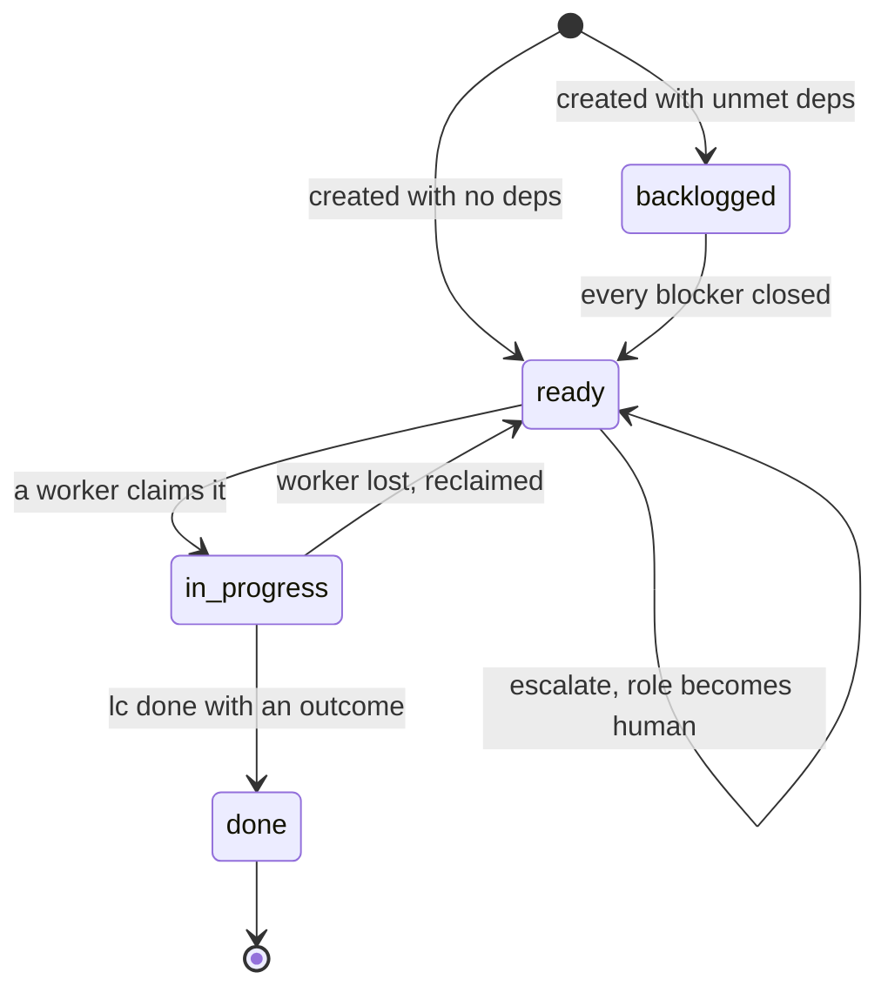

# State lifecycle

Every node has one `state`. It is a small kanban-style machine: a board has many columns, but they
all group into "not ready", "ready", "doing", "done".

- **backlogged** - not ready for processing (an item not yet activated, or a step with an unmet
  dependency).
- **ready** - defined and waiting to be picked up by its assignee once there is capacity.
- **in_progress** - claimed by a worker and executing.
- **done** - complete; the `outcome` says how it ended.

`role` and `outcome` ride alongside the state, not inside it. Escalation to a human keeps the state
at `ready` and sets `role=human`; abandonment is `done` with `outcome=abandoned`.

## Steps drive it; parents roll up

Steps store their state. A **completing step advances the flow first, then closure cascades up** -
`complete_step` creates the next step _before_ checking whether the item is finished, so an item is
never seen as `done` in the gap between one step closing and the next opening.

A parent's state is derived from its children (`roll_up`):

| Children              | Parent state |
| --------------------- | ------------ |
| none                  | backlogged   |
| all done              | done         |
| some done, some not   | in_progress  |
| any in_progress       | in_progress  |
| otherwise (all ready) | ready        |

## Lanes are a view of (state, role)

The `lc status` / `lc inbox` / `lc queue` / `lc active` boards are not stored - they are derived from
each step's `(state, role)` by `lane_for`:

| state       | role  | lane    |
| ----------- | ----- | ------- |
| ready       | human | inbox   |
| ready       | agent | queue   |
| in_progress | any   | active  |
| backlogged  | any   | blocked |
| done        | any   | done    |

Lanes run over **steps only** - items and themes never appear in a lane (they live in `lc backlog`
and the theme roll-up). A step that is `backlogged` because of an unmet dependency is what shows in
the `blocked` lane.
