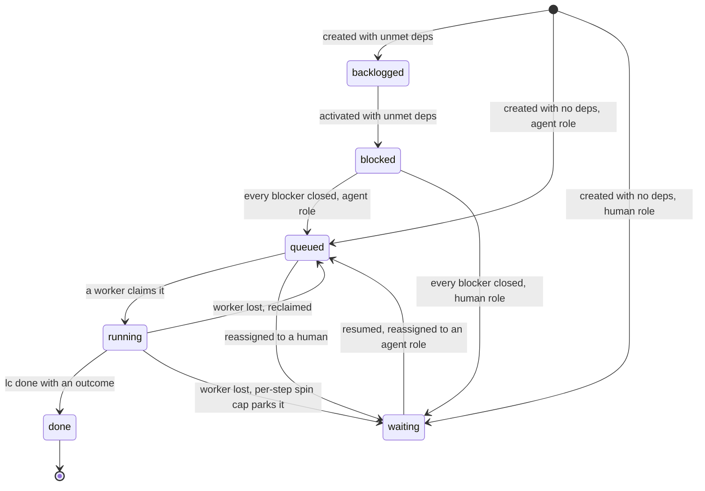

# State lifecycle

An item and a step each have one `state`. Six labels, one per **what the node is waiting on**.

```mermaid
stateDiagram-v2
  [*] --> backlogged: created with unmet deps
  [*] --> queued: created with no deps, agent role
  [*] --> waiting: created with no deps, human role
  backlogged --> blocked: activated with unmet deps
  blocked --> queued: every blocker closed, agent role
  blocked --> waiting: every blocker closed, human role
  queued --> running: a worker claims it
  running --> done: lc done with an outcome
  running --> queued: worker lost, reclaimed
  running --> waiting: worker lost, per-step spin cap parks it
  queued --> waiting: reassigned to a human
  waiting --> queued: resumed, reassigned to an agent role
  done --> [*]
```

- **backlogged** - not activated yet; nothing is waiting on anything.
- **blocked** - waiting on another item or step's unresolved dependency.
- **queued** - waiting on a worker slot.
- **running** - a worker is on it right now.
- **waiting** - waiting on the human: a gate or an escalation, undifferentiated at item level.
- **done** - terminal; the `outcome` says how it ended, and (for an item) `disposition` says whether that ending was a completion or an abandonment.

`role`, `outcome` and `disposition` ride alongside the state, not inside it. An unassigned, unblocked step with `role=human` is `waiting`, not `queued` - the state already encodes "needs a human." Reassigning a step to `human` (`route_to_human`, i.e. `lc set <step> --state waiting`) sets state to `waiting`; reassigning it back to an agent role sets it to `queued`.

## The raw storage column keeps its own, older vocabulary

The `items`/`steps` tables' raw `state` column still only ever holds one of four legacy strings (`backlogged`, `ready`, `in_progress`, `done`) - `claim_ready`/`ready_steps` filter and compare-and-swap against the literal string `'ready'` in SQL, not through the six-value domain type. The six domain values map onto that raw column many-to-one (`blocked` -> `backlogged`; `queued`/`waiting` -> `ready`; `running` -> `in_progress`), and `history` records the full six-value `state` on every transition regardless. A `history` row written before this model shipped still reads `in_progress`/`ready` in the old spelling; nothing rewrites those rows, and `Duration` (`domain/feedback/duration.py`) looks for either spelling permanently, not as a one-time migration.

## Steps drive it; the item rolls up

Steps store their state. A **completing step advances the flow first, then closure cascades up** - `complete_step` creates the next step _before_ checking whether the item is finished, so an item is never seen as `done` in the gap between one step closing and the next opening.

An item's state is derived from its own unresolved dependency first, then its steps (`roll_up`):

| Item's own `blocked_by` | Children                          | State      |
| ------------------------ | ---------------------------------- | ---------- |
| non-empty                 | (any)                               | blocked    |
| empty                     | none                                | backlogged |
| empty                     | all done                            | done       |
| empty                     | any `waiting`                       | waiting    |
| empty                     | any `running` (no `waiting`)        | running    |
| empty                     | any `queued` (no `waiting`/`running`) | queued     |
| empty                     | any `blocked` and the rest `done`   | blocked    |

The item's own dependency block outranks whatever its children are doing - it does not compete in the child-state precedence race. Within the children themselves, precedence is `waiting > running > queued > blocked`: if any part of the item needs the human, that outranks everything else, because it is the only position where the item stops until they act.

## Lanes are a view of `state` alone

The `lc status` / `lc inbox` / `lc queue` / `lc active` boards are not stored - they are derived from each step's `state` by `lane_for`. `role` is no longer a separate input: `waiting` already encodes "this needs a human."

| state      | lane   |
| ---------- | ------ |
| waiting    | inbox  |
| running    | active |
| done       | done   |
| backlogged | queue  |
| blocked    | queue  |
| queued     | queue  |

Lanes run over **steps only** - items never appear in a lane (they live in `lc backlog` and the item roll-up). A `blocked` step shows in the `queue` lane alongside runnable steps, not in a lane of its own - nothing is asked of anyone while it waits on its dependency, so it is not treated as an attention signal. It stays distinguishable by its `blocked_by` field, which every reader of the queue (`lc status`, `lc queue`, the priority list) can use to show what it is waiting on.

## Disposition: how a closed item ended

An item's `disposition` (`completed` or `aborted`) is set once, at close, alongside `outcome`. It answers a different question than `outcome` does: `outcome` is the workflow's own routing label (`merged`, `abandoned`, `wontfix`, ...); `disposition` is the engine's classification of whether that label was a delivery or an abandonment. A workflow bundle declares the mapping per outcome name in its `disposition:` section; `lc done <item> <outcome>` resolves it from the bundle, or refuses and asks for `--disposition` explicitly when the outcome isn't bundle-declared, rather than writing a guessed or `NULL` value.
