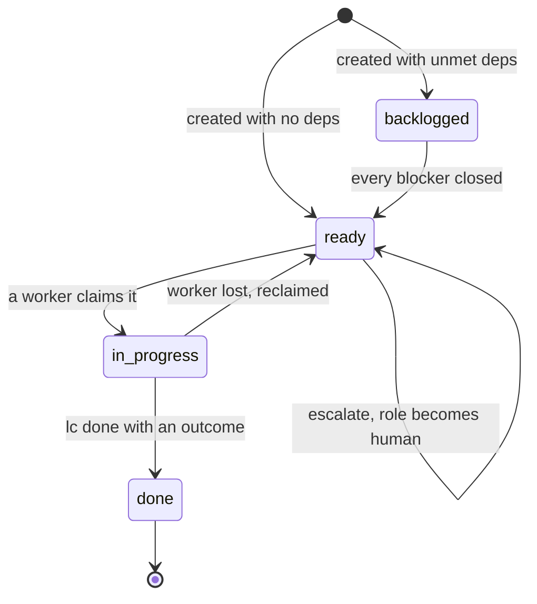

# State lifecycle

An item and a step each have one `state`. It is a small kanban-style machine: a board has many columns, but they all group into "not ready", "ready", "doing", "done".

```mermaid
stateDiagram-v2
  [*] --> backlogged: created with unmet deps
  [*] --> ready: created with no deps
  backlogged --> ready: every blocker closed
  ready --> in_progress: a worker claims it
  in_progress --> done: lc done with an outcome
  in_progress --> ready: worker lost, reclaimed
  ready --> ready: escalate, role becomes human
  done --> [*]
```

- **backlogged** - not ready for processing (an item not yet activated, or a step with an unmet dependency).
- **ready** - defined and waiting to be picked up by its assignee once there is capacity.
- **in_progress** - claimed by a worker and executing.
- **done** - complete; the `outcome` says how it ended.

`role` and `outcome` ride alongside the state, not inside it. Escalation to a human keeps the state at `ready` and sets `role=human`; abandonment is `done` with `outcome=abandoned`.

## Steps drive it; the item rolls up

Steps store their state. A **completing step advances the flow first, then closure cascades up** - `complete_step` creates the next step _before_ checking whether the item is finished, so an item is never seen as `done` in the gap between one step closing and the next opening.

An item's state is derived from its steps (`roll_up`):

| Children              | Parent state |
| --------------------- | ------------ |
| none                  | backlogged   |
| all done              | done         |
| some done, some not   | in_progress  |
| any in_progress       | in_progress  |
| otherwise (all ready) | ready        |

## Lanes are a view of (state, role)

The `lc status` / `lc inbox` / `lc queue` / `lc active` boards are not stored - they are derived from each step's `(state, role)` by `lane_for`:

| state       | role  | lane   |
| ----------- | ----- | ------ |
| ready       | human | inbox  |
| ready       | agent | queue  |
| in_progress | any   | active |
| backlogged  | any   | queue  |
| done        | any   | done   |

Lanes run over **steps only** - items never appear in a lane (they live in `lc backlog` and the item roll-up). A step that is `backlogged` because of an unmet dependency shows in the `queue` lane alongside runnable steps, not in a lane of its own - nothing is asked of anyone while it waits on its dependency, so it is not treated as an attention signal. It stays distinguishable by its `blocked_by` field, which every reader of the queue (`lc status`, `lc queue`, the priority list) can use to show what it is waiting on.
