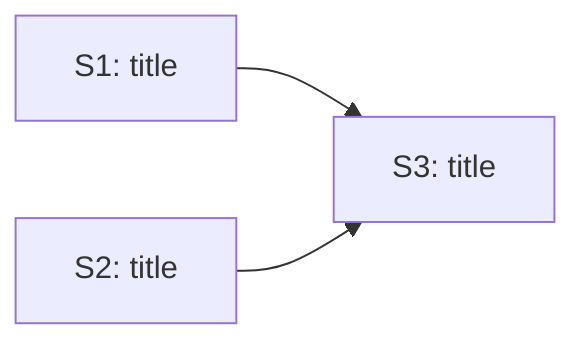

# Plan doc format guide

The plan doc is the review surface the human reads at the gate. Structure it as decisions + a
decomposition DAG + a task table + risks. Keep narrative minimal - the human already knows the
context from the driver session.

## Summary

2-3 sentences: what this plan builds and the key architectural choice. Not the brief restated.

## Assumptions

Bullet list of decisions you inferred from the brief where the brief was silent. A thin brief
surfaces as a long list here - that is the signal the human needs to catch drift at the gate in
seconds. Each assumption should be falsifiable ("I assumed X; if Y, change Z").

## Decomposition

A mermaid DAG of the child stories and their blocked-by edges. Node labels are `S<N>[title]`.

Caption below the diagram: one sentence on what drives the ordering.

## Task table

| # | Title | Blocked by | Contract (acceptance) | Size |
|---|-------|------------|----------------------|------|
| 1 | ...   | -          | ...                  | S/M/L |

Contract column: one clause the reviewer can check - "X is present and does Y". Not prose.

## Risks

Short bullets only. These are the soft spots the human should probe during the review; they are
not built into any child spec. Keep to 3-5.
